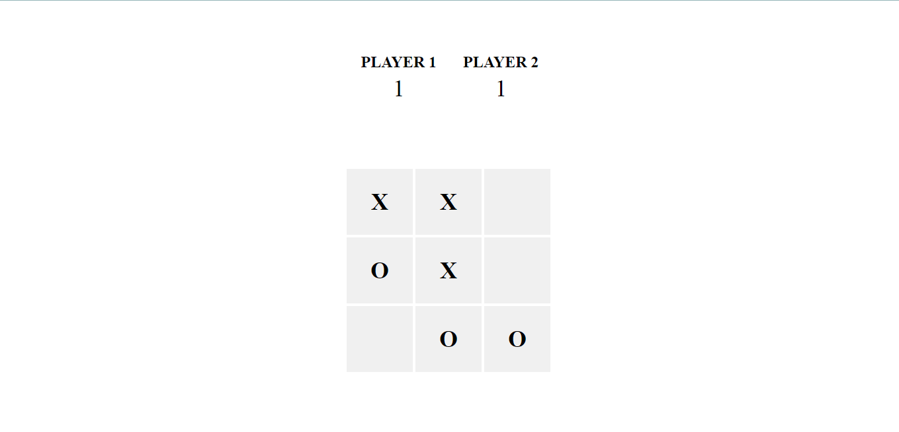

# Tic Tac Toe

This project is created to **learn JavaScript** and **demonstrate its functionality**. It showcases how to build a simple Tic Tac Toe game using HTML, CSS, and JavaScript. The game features both Player vs. Computer and Player vs. Player modes, providing a practical example of JavaScript concepts and DOM manipulation.

A simple Tic Tac Toe game implemented using HTML, CSS, and JavaScript. This project demonstrates both Player vs. Computer and Player vs. Player game modes.

## Screenshots

Here are some screenshots of the game:

## Features

- **Player vs. Player**: Two players take turns to mark X and O on a 3x3 grid.
- **Player vs. Computer**: One player competes against an AI-controlled opponent.

## Usage

1. **Open the Game**:
    Open `index.html` in a web browser to start playing the game.

2. **Choose a Mode**:
    - To play Player vs. Player, the game mode is handled by `script.js`.
    - To play Player vs. Computer, the game mode is handled by `script2.js`.

3. **Play the Game**:
    - Click on any empty cell to make a move.
    - The game will automatically detect a win or draw and display the result.
    - Click the "Reset Game" button to start a new game.

## Contributing

Feel free to open issues or submit pull requests if you find bugs or have suggestions for improvements.

